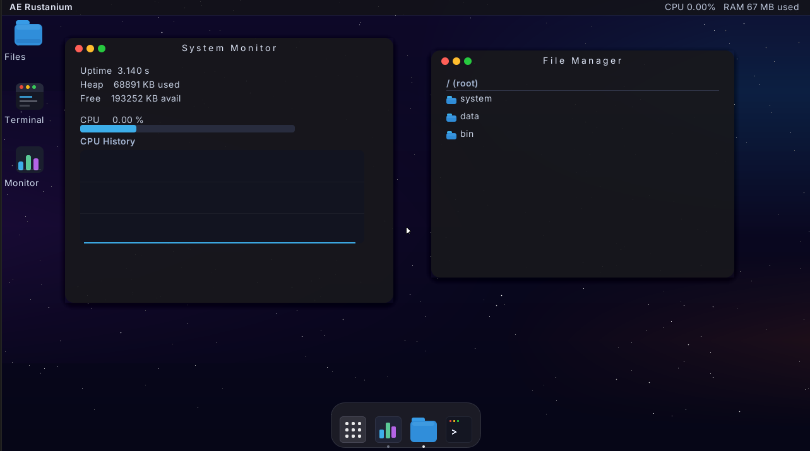

# 🚀 Rustix OS: Safe, Fault-Tolerant & Self-Healing Operating System with a Premium GUI

[](https://www.rust-lang.org)
[](LICENSE)
[](#safety--architecture-principles)

<p align="center">
  
</p>

**Rustix OS** (originally developed as *AE Rustanium*) is a custom, microkernel-inspired bare-metal operating system for the **x86-64 architecture**, specifically designed to survive **hardware bit-flips, silent data corruption, and cosmic radiation** without system failure, while booting directly into a custom, premium **macOS-inspired graphical user interface**.

Instead of relying solely on hardware-level ECC RAM, Rustix OS implements an active, software-defined fault-tolerance layer in its microkernel (`kernel-x86`) coupled with a secure user-space runtime (`usermode-x86`) that executes a premium, mathematically-rendered Desktop Environment (`usermode-desktop`).

---

## 📐 Architecture & Workspace Structure

Rustix OS is designed with strict module boundaries inside a Cargo workspace. Core algorithms are separated into standard `no_std` libraries that are then integrated into the bare-metal x86-64 bootable image or run in Ring 3 user-space:

```
Rustix OS/ (Workspace Root)
├── Cargo.toml
├── kernel-x86/           # Real bare-metal x86-64 target wrapper using the bootloader_api
├── kernel-core/          # Safe kernel bootstrapping, microservices coordinator, and telemetry
├── memory-subsystem/     # Software SECDED ECC, page frame allocator, and background scrubber
├── scheduler/            # Preemptive task dispatcher & TMR voting engine
├── virtual-fs/           # Inode-based virtual filesystem backed by virtual physical frames
├── usermode-x86/         # System call bindings and user-space runtime library
├── usermode-desktop/     # Premium macOS-style graphical desktop environment (Ring 3)
├── simulation-dashboard/ # Local host development terminal simulator & fault injector
└── runner/               # Host orchestration crate to build kernel images and launch QEMU
```

---

## 🖥️ Premium User-Space Desktop Environment (`usermode-desktop`)

Unlike typical hobby operating systems that use legacy VGA text mode, Rustix OS boots into a full Ring 3 user-space desktop environment rendering directly to the UEFI **Graphics Output Protocol (GOP)** linear framebuffer:

*   **📐 Mathematical Vector Drawing**: Windows and UI elements are rendered with smooth mathematical curves, anti-aliasing emulation, and sub-pixel blending, escaping raw blocky pixel alignments.
*   **🌫️ macOS-Style Drop Shadows**: Implements multi-layered alpha-blended soft drop shadows, making windows appear realistically suspended in 3D space above the desktop.
*   **🍎 Dynamic macOS Dock**: A sleek, bottom-aligned dock featuring interactive mouse hover scale-magnification, similar to macOS.
*   **📊 System Telemetry & Widgets**: Real-time graphs showing memory allocations, CPU/Heap statistics, and background bit-flip scrubbing logs.
*   **⌨️ Monospace Font Engine**: Uses a pre-rendered, high-quality monospace font atlas for rendering consoles and window terminals cleanly.

---

## 🛡️ Software-Defined Fault Tolerance & Safety

To keep spaceborne or high-altitude flight computers functional without crash-induced hardware failures, Rustix OS coordinates multiple software-defined reliability layers:

*   **💾 Software SECDED ECC Pages**: All physical memory frames can be wrapped in a software SECDED (Single Error Correction, Double Error Detection) Hamming Code block, verifying data integrity on reads and rewriting corrected data on single-bit failures.
*   **🧹 Memory Scrubbing Daemon**: Runs as a background cooperative thread, scanning allocated memory frames page-by-page to detect and correct latent single-bit flips before they impact active programs.
*   **🗳️ Triple Modular Redundancy (TMR)**: Crucial flight calculations run in triplicate across isolated memory spaces. A software ALU voter performs 2-out-of-3 majority verification to detect and repair register-level bit-flips on the fly.
*   **☣️ Quarantine & Hot-Swap**: If a severe, uncorrectable double-bit flip is identified, the kernel isolates the damaged physical frame, dynamically provisions a healthy frame, and migrates task data safely.

---

## 🚀 Running the Operating System

### 1. Emulating the Bare-Metal OS in QEMU
We have automated the building and booting process. No manual image partitioning or external bootimage tools are required.

*   Ensure you have [QEMU](https://www.qemu.org/) installed and added to your system path.
*   Ensure you have the Visual Studio C++ Build Tools installed (needed for host toolchain compilation).
*   Execute the host orchestrator runner (the correct nightly MSVC toolchain and components will be selected automatically via [rust-toolchain.toml](file:///a:/AE%20Projects/Rustix%20OS/rust-toolchain.toml)):
    ```bash
    cargo run --package runner -- --release
    ```
This utility automatically compiles `usermode-desktop` to a flat binary, builds the `kernel-x86` for `x86_64-unknown-none`, outputs flashable BIOS (`bios.img`) and GPT UEFI (`uefi.img`) disk partition files, and boots QEMU with serial output mirrored directly to your active developer terminal.

### 2. Booting on Physical Hardware (UEFI)
To run this OS on real x86-64 computer systems (e.g. Intel/AMD processors):
1. Locate the generated raw GPT disk image at `target/x86_64-unknown-none/release/uefi.img`.
2. Flash the raw image to an external USB storage drive using a tool like **Rufus** (select **DD Image Mode** to write raw partitions directly) or **BalenaEtcher**.
3. Restart your target computer, enter BIOS settings, disable **Secure Boot**, choose the USB drive as your boot device in the UEFI boot menu, and watch Rustix OS boot bare-metal.

---

## 📜 License

This project is licensed under the Apache License, Version 2.0. See the [LICENSE](LICENSE) and [NOTICE](NOTICE) files for details.
