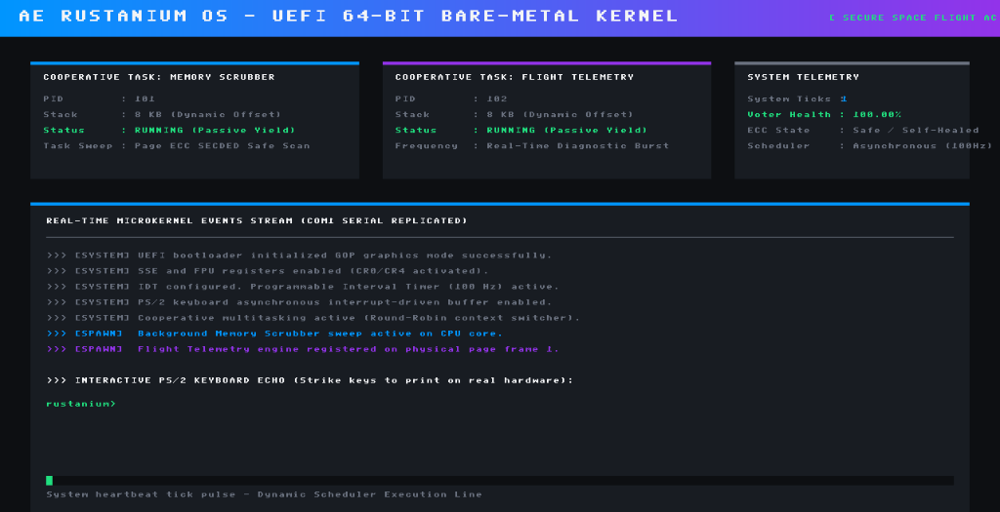
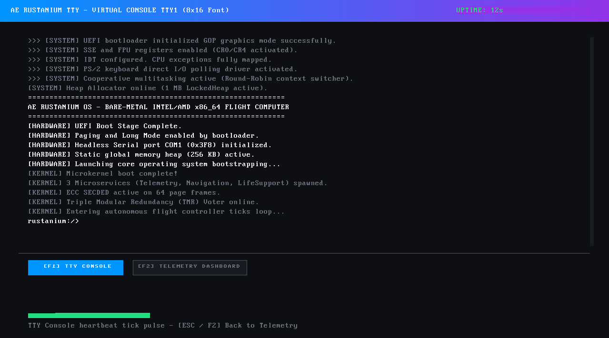

# 🚀 AE Rustanium: Safe, Fault-Tolerant & Self-Healing Bare-Metal Operating System

[](https://www.rust-lang.org)
[](LICENSE)
[](#safety--architecture-principles)

**AE Rustanium** is a custom, microkernel-inspired bare-metal operating system for **x86-64 architecture** processors, specifically designed to handle **hardware bit-flips, silent data corruption, and cosmic radiation** without system failure. It targets aerospace computers, deep space probes, and high-altitude systems where Single Event Upsets (SEUs) pose critical failure risks.

Instead of relying solely on hardware-level ECC RAM, AE Rustanium implements an active, software-defined fault-tolerance layer. It features a native bootable x86-64 microkernel target (`kernel-x86`) that boots directly on modern UEFI/BIOS hardware, initializes direct graphics via UEFI GOP, executes cooperative multitasking via assembly context-switching, and runs background scrubbing daemons alongside Triple Modular Redundancy (TMR) voting systems.

---

## 📐 Architecture & Workspace Structure

AE Rustanium is designed with strict module boundaries inside a Cargo workspace. Core algorithms are separated into standard `no_std` libraries that are then integrated into the bare-metal x86-64 bootable image:

```
AE Rustanium/ (Workspace Root)
├── Cargo.toml
├── kernel-x86/           # Real bare-metal x86-64 target wrapper using the bootloader_api
├── kernel-core/          # Safe kernel bootstrapping, microservices coordinator, and telemetry
├── memory-subsystem/     # Software SECDED ECC, page frame allocator, and background scrubber
├── scheduler/            # Preemptive task dispatcher & TMR voting engine
├── virtual-fs/           # Inode-based virtual filesystem backed by virtual physical frames
├── simulation-dashboard/ # Local host development terminal simulator & fault injector
└── runner/               # Host orchestration crate to build kernel images and launch QEMU
```

---

## 🛠️ Bare-Metal x86-64 Kernel Features (`kernel-x86`)

The core of the project is a fully-fledged, bootable bare-metal operating system. Using the `bootloader_api` framework, it boots on both legacy BIOS systems and modern UEFI flight computers.

### 🖥️ Dual-Mode UEFI GOP Graphics Console
Instead of relying on legacy, fragile VGA text mode (`0xB8000`), AE Rustanium binds directly to the UEFI **Graphics Output Protocol (GOP)** linear framebuffer to render a premium dark-themed console with two runtime views:

*   **📊 F2 — Telemetry Dashboard**: A real-time control panel rendering thread activity cards, system ticks, TMR voter stability statistics, and active memory allocation grids.
    
    

*   **🖥️ F1 — Full-Screen TTY Console**: A scrollable virtual terminal displaying colored system logs and an interactive shell. It renders text using a built-in monospace bitmap font. Supports Page Up/Down navigation over a 250-line log history buffer.

    

### ⚙️ Low-Level Kernel & Hardware Integration
*   **Cooperative Multitasking & Assembly Context-Switching**: Implements cooperatively scheduled execution threads running on independent 8 KB stacks. Thread yield and swap operations are managed by a custom inline assembly context switcher (`switch_context`) that preserves callee registers.
*   **SSE & FPU Hardware Activation**: Initializes control registers (`CR0` and `CR4`) during boot stages to enable SSE and SIMD instruction sets, preventing invalid opcode exceptions on bulk memory actions.
*   **LockedHeap Dynamic Allocator**: Bypasses leaky bump allocators by integrating `linked_list_allocator::LockedHeap` with a 1 MB heap buffer, reclaiming deallocated memory to ensure leak-free continuous operation.
*   **Unified Visual Panic Screen**: Features a robust exception handling framework. Upon division-by-zero, page faults, or double faults, it forcefully unlocks graphics handlers and prints complete diagnostic crash traces directly onto a high-visibility red screen.
*   **Interrupt & Polling Hardware Drivers**: Utilizes cooperative I/O polling for high safety margins on modern motherboards. Decodes PS/2 keyboard scancodes directly from I/O ports `0x60` and `0x64` (supporting both US and Turkish Q layouts via the `loadkeys` command) and streams diagnostics to the COM1 UART serial port (`0x3F8`).

---

## 🛡️ Software-Defined Fault Tolerance & Safety

To keep spaceborne computers functional without crash-induced hardware failures, AE Rustanium coordinates multiple software-defined reliability layers:

*   **💾 Software SECDED ECC Pages**: All physical memory frames can be wrapped in a software SECDED (Single Error Correction, Double Error Detection) Hamming Code block, verifying data integrity on reads and rewriting corrected data on single-bit failures.
*   **🧹 Memory Scrubbing Daemon**: Runs as a background cooperative thread, scanning allocated memory frames page-by-page to detect and correct latent single-bit flips before they impact active programs.
*   **☣️ Quarantine & Hot-Swap**: If a severe, uncorrectable double-bit flip is identified, the kernel isolates the damaged physical frame, dynamically provisions a healthy frame, and migrates task data safely.
*   **🗳️ Triple Modular Redundancy (TMR)**: Crucial flight calculations (like Navigation delta-V calculations) run in triplicate across isolated memory spaces. A software ALU voter performs 2-out-of-3 majority verification to detect and repair register-level bit-flips on the fly.

---

## 🚀 Running the Operating System

### 1. Local Testing & Verification
You can compile and run the interactive console simulator directly on your host machine (Windows/Linux/macOS) to test the mathematical models, SECDED correction, TMR voters, and filesystem logic:
```bash
cargo run --package simulation-dashboard
```

You can also run the full test suite verifying Hamming ECC decoding, memory allocation bounds, and TMR voting math:
```bash
cargo test --workspace
```

### 2. Emulating the Bare-Metal Kernel in QEMU
We have automated the building and booting process. No manual image partitioning or `bootimage` setups are required.

*   Ensure you have [QEMU](https://www.qemu.org/) installed and added to your system path.
*   Execute the host orchestrator runner:
    ```bash
    cargo run --package runner
    ```
This utility automatically compiles `kernel-x86` for `x86_64-unknown-none`, outputs flashable BIOS (`bios.img`) and GPT UEFI (`uefi.img`) disk partition files, and boots QEMU with serial output mirrored directly to your active developer terminal.

### 3. Booting on Physical Hardware (UEFI)
To run this kernel on real x86-64 computer systems:
1. Locate the generated raw GPT disk image at `target/x86_64-unknown-none/debug/uefi.img` (or `release/uefi.img` if compiled with `--release`).
2. Flash the raw image to an external USB storage drive using a tool like **Rufus** (select **DD Image Mode** to write raw partitions directly).
3. Restart your target computer, choose the USB drive as your boot device in the UEFI boot menu, and watch AE Rustanium boot bare-metal.

---

## 📜 License

This project is licensed under the Apache License, Version 2.0. See the [LICENSE](LICENSE) and [NOTICE](NOTICE) files for details.
